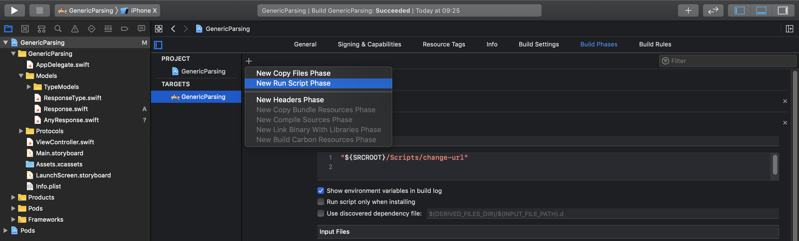
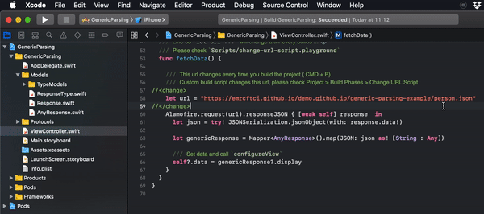

# Swift Generic Parsing with ObjectMapper

Purpose of the project
======================

:boom: This project will help you to understand generic parsing via [ObjectMapper](https://github.com/tristanhimmelman/ObjectMapper)

Table of contents :page_with_curl:
=================

<!--ts-->
   * [Swift Generic Parsing with ObjectMapper](#purpose-of-the-project)
   * [Tools and components](#tools-and-components)
      * [Parsing Generic Types](#parsing-generic-types)
      * [Build Script](#build-script)
   * [To-do list](#to-do-list-heavy_check_mark)
      * [ObjectMapper Installation](#objectMapper-installation)
        * [via Swift Package Manager](#via-swift-package-manager)
        * [via Cocoapods](#via-cocoapods)
        * [via Carthage](#via-carthage)
        * [via Manually](#via-manually)
      * [Alamofire Installation](#alamofire-installation)
        * [via Swift Package Manager](#via-swift-package-manager)
        * [via Cocoapods](#via-cocoapods)
        * [via Carthage](#via-carthage)
        * [via Manually](#via-manually)
      * [ObjectMapper Protocols](#objectMapper-protocols)
        * [StaticMappable](#staticMappable)
        * [BaseMappable](#baseMappable)
      * [Custom Build Script](#custom-build-script-rocket)
        * [Why we use that?](#why-we-use-that)
        * [Add the Script to XCode](#add-the-script-to-xCode)
        * [Our Usage](#our-usage)
   * [Resources](#resources-book)
   * [Find this docs useful?](#find-this-docs-useful-interrobang)
   * [License](#license)
<!--te-->

Tools and components
====================

Parsing Generic Types
-------------------------

:bangbang: **Parsing Generic Types** provides less line of code for mapping different objects. Please visit [ObjectMapper github page](https://github.com/tristanhimmelman/ObjectMapper), [ObjectMapper CocoaDocs page](http://cocoadocs.org/docsets/ObjectMapper/0.2/) or [Object Mapping in Swift Medium Article](https://medium.com/nsistanbul/object-mapping-in-swift-d9cd7ecd47dd) fore more detail.

Build Script
--------

:100: **Build Script** changes URL of source every build.

To-do list :heavy_check_mark:
==========

This to-do list is consist of 4 sections. We will see how to install libraries, parsing generics and write a build script with Swift. :rocket:

ObjectMapper Installation
------------------------------

In this part, we will learn how to install ObjectMapper via Swift Package Manager, Cocoapods, Carthage and Manually. Please visit [Cocoadocs Documentation](http://cocoadocs.org/docsets/ObjectMapper/0.2/) for more details.

#### via Swift Package Manager

To add ObjectMapper to a Swift Package Manager based project, add:

```
.Package(url: "https://github.com/Hearst-DD/ObjectMapper.git", majorVersion: 2, minor: 2),
```
to your Package.swift files dependencies array.


#### via Cocoapods

ObjectMapper can be added to your project using Cocoapods 0.36 (beta) by adding the following line to your Podfile:

```
pod 'ObjectMapper', '~> 0.2'
```

#### via Carthage

You can add a dependency on ObjectMapper by adding it to your Cartfile:

```
github "Hearst-DD/ObjectMapper" ~> 0.2
```

#### via Manually

1. Add ObjectMapper as a submodule by opening the terminal, cd-ing into your top-level project directory, and entering the command git submodule add https://github.com/Hearst-DD/ObjectMapper.git

2. Open the ObjectMapper folder, and drag ObjectMapper.xcodeproj into the file navigator of your app project.

3. In Xcode, navigate to the target configuration window by clicking on the blue project icon, and selecting the application target under the "Targets" heading in the sidebar.

4. Ensure that the deployment target of ObjectMapper.framework matches that of the application target.

5. In the tab bar at the top of that window, open the "Build Phases" panel.

6. Expand the "Target Dependencies" group, and add ObjectMapper.framework.

7. Click on the + button at the top left of the panel and select "New Copy Files Phase". Rename this new phase to "Copy Frameworks", set the "Destination" to "Frameworks", and add ObjectMapper.framework.


Alamofire Installation
----------------------

In this part, we will learn how to install Alamofire via Swift Package Manager, Cocoapods, Carthage and Manually. Please visit [Cocoadocs Documentation](http://cocoadocs.org/docsets/ObjectMapper/0.2/) for more details.

#### via Swift Package Manager

To add Alamofire to a Swift Package Manager based project, add:

```
.Package(url: "https://github.com/Alamofire/Alamofire.git", majorVersion: 4),
```
to your Package.swift files dependencies array.

#### via Cocoapods

To integrate Alamofire into your Xcode project using CocoaPods, specify it in your Podfile:

```
pod 'Alamofire', '~> 5.0.0-rc.3'
```

#### via Carthage

To integrate Alamofire into your Xcode project using Carthage, specify it in your Cartfile:

```
github "Alamofire/Alamofire" "5.0.0-rc.3"
```

#### via Manually

If you prefer not to use any of the aforementioned dependency managers, you can integrate Alamofire into your project manually.

1. Open up Terminal, cd into your top-level project directory, and run the following command "if" your project is not initialized as a git repository:
```
$ git init
```

2. Add Alamofire as a git submodule by running the following command:
```
$ git submodule add https://github.com/Alamofire/Alamofire.git
```

3. Open the new Alamofire folder, and drag the Alamofire.xcodeproj into the Project Navigator of your application's Xcode project.

    - It should appear nested underneath your application's blue project icon. Whether it is above or below all the other Xcode groups does not matter.

4. Select the Alamofire.xcodeproj in the Project Navigator and verify the deployment target matches that of your application target.

5. Next, select your application project in the Project Navigator (blue project icon) to navigate to the target configuration window and select the application target under the "Targets" heading in the sidebar.

6. In the tab bar at the top of that window, open the "General" panel.

7. Click on the + button under the "Embedded Binaries" section.

8. You will see two different Alamofire.xcodeproj folders each with two different versions of the Alamofire.framework nested inside a Products folder.

     - It does not matter which Products folder you choose from, but it does matter whether you choose the top or bottom Alamofire.framework.

9. Select the top Alamofire.framework for iOS and the bottom one for macOS.

    - You can verify which one you selected by inspecting the build log for your project. The build target for Alamofire will be listed as either Alamofire iOS, Alamofire macOS, Alamofire tvOS or Alamofire watchOS.

10. And that's it!

    - The Alamofire.framework is automagically added as a target dependency, linked framework and embedded framework in a copy files build phase which is all you need to build on the simulator and a device.


ObjectMapper Protocols
---------------------

These are protocols of ObjectMapper which we'll use for parsing generic responses.

#### StaticMappable


> **StaticMappable** is an alternative to **Mappable**. It provides developers with a static function that is used by ObjectMapper for object initialization instead of **init?(map: Map)**.
>
>Note: **StaticMappable**, like **Mappable**, is a sub protocol of **BaseMappable** which is where the **mapping(map: Map)** function is defined.
>
>```
>static func objectForMapping(map: Map) -> BaseMappable?
>```

>ObjectMapper uses this function to get objects to use for mapping. Developers should return an instance of an object that conforms to **BaseMappable** in this function. This function can also be used to:
>
> 1. validate JSON prior to object serialization
> 2. provide an existing cached object to be used for mapping
> 3. return an object of another type (which also conforms to BaseMappable) to be used for mapping. For instance, you may inspect the JSON to infer the type of object that should be used for mapping (see examples in ClassClusterTests.swift)
>
>If you need to implement ObjectMapper in an extension, you will need to adopt this protocol instead of Mappable.

**Our Usage**

``` swift

import ObjectMapper

/// Firstly we should map "type" key for recognize what kind of object will come
public class AnyResponse: StaticMappable {

  public var type: ResponseType = .undefined

  /// `data` returns an object which has correct type and conforms `ViewModelProtocol`
  public var data: ViewModelProtocol? {
    return AnyResponse.dataFor(self)
  }

  public func mapping(map: Map) {
    type <- (map["type"], EnumTransform<ResponseType>())
  }

  public class func objectForMapping(map: Map) -> BaseMappable? {
    /// Map type first
    let type: ResponseType = try! map.value("type", using: EnumTransform<ResponseType>())

    /// Then we can check the type for return correct model
    ///
    /// Response<Space>(): return Response with <T> -T is Space for this case-
    /// Constructor `()` call the map function of Response<T> and T is set before calling
    switch type {
    case .space:
      return Response<Space>()

    case .company:
      return Response<Company>()

    case .continent:
      return Response<Continent>()

    case .person:
      return Response<Person>()

    case .undefined:
      return nil
    }
  }

  /// Helper function for return correct `ViewModelProtocol` object to use UI configuration
  ///
  /// *Example:* `SpaceViewModel` has an initializer like -> `init(component: Response<Space>)` so `component.unpacked()` function's <T> parameter is `Space` for this example.
  private class func dataFor(_ component: AnyResponse) -> ViewModelProtocol? {

    switch component.type {
    case .space:
      return SpaceViewModel(component: component.unpacked())

    case .company:
      return CompanyViewModel(component: component.unpacked())

    case .continent:
      return ContinentViewModel(component: component.unpacked())

    case .person:
      return PersonViewModel(component: component.unpacked())

    case .undefined:
      return nil
    }
  }

  /// Unpacked `AnyResponse` with correct object (`T`) and return Response with <T>
  private func unpacked<T>() -> Response<T> {
    return self as! Response<T>
  }
}
```

#### BaseMappable

The following lines are describing `BaseMappable` in **ObjectMapper**'s source code.

``` swift
/// BaseMappable should not be implemented directly. Mappable or StaticMappable should be used instead
public protocol BaseMappable {
    /// This function is where all variable mappings should occur. It is executed by Mapper during the mapping (serialization anddeserialization) process.
    mutating func mapping(map: Map)
}
```

**Our Usage**

``` swift

import ObjectMapper

/// Response contains our data field for map generic type objects
public final class Response<T: BaseMappable>: AnyResponse, Mappable {

  /// This will be our models (`Continent, Company, Person, Space`)
  public var detail: T!

  public override init() {
    super.init()
  }

  public required init?(map: Map) {
    super.init()
    detail = try? map.value("detail")
  }

  /// Called after `objectForMapping(map: ) -> BaseMappable?` returns a correct T object
  public override func mapping(map: Map) {
    super.mapping(map: map)
    detail <- map["detail"]
  }
}
```

Custom Build Script :rocket:
-------------------

#### Why we use that?

1. We need to change endpoint to get different kind of objects from response.
2. We can change the endpoint simultaneously with the build
3. We can learn about XCode custom build scripts :fire:

#### Add the Script to XCode

1. Write a script for something :poop:
2. Open XCode project
3. Select Project Navigator > Project > Build Phases
4. Add Run Script 

<p align="left" style="padding-left: 15px">
    
</p>

> `${SRCROOT}` is the path to the directory containing the Xcode project.
> [SO answer](https://stackoverflow.com/a/3719314/7512091)


#### Our Usage

``` swift
#!/usr/bin/env xcrun --sdk macosx swift

import Foundation

// MARK: - Extension for get url string from ViewController.swift
extension String {

    func slice(from: String, to: String) -> String? {

        return (range(of: from)?.upperBound).flatMap { substringFrom in
            (range(of: to, range: substringFrom..<endIndex)?.lowerBound).map { substringTo in
                String(self[substringFrom..<substringTo])
            }
        }
    }
}

/// Returns random element of given `URLs`
/// Function calls itself until `randomlySelected` has a different value
/// - Parameters:
///   - URLs: Array of URLs for pick up random element
///   - current: URL for pick up different element from URLs
func randomElement(for URLs: [String], with currentURL: String) -> String? {

    let randomlySelected = URLs.randomElement()!

    if currentURL.contains(randomlySelected) {
        return randomElement(for: URLs, with: currentURL)
    }
    return randomlySelected
}

/// Base URL contains different JSON files
let BASE_URL = "https://emrcftci.github.io/demo.github.io/generic-parsing-example/"

let URLs = [
  "continent.json",
  "space.json",
  "person.json",
  "company.json"
]

/// Project directory without "/Scripts/change-url"
let PROJECT_DIR = URL(fileURLWithPath: #file).pathComponents.map { "\($0)/" }.dropFirst().dropLast().dropLast().joined()

/// ViewController.swift file's directory
let FILE_DIR = "/\(PROJECT_DIR)GenericParsing/ViewController.swift"

do {
    /// All texts in ViewController.swift
    let CONTENTS = try String(contentsOfFile: FILE_DIR)

    /// URL line between `<changed></changed>` tags
    let URL_LINE = CONTENTS.slice(from: "<change>", to: "//</change>")!

    let RANDOMLY_SELECTED_ENDPOINT = randomElement(for: URLs, with: URL_LINE)!

    /// Modified line for updated ViewController.swift
    let CHANGED_URL = "\n    let url = " + "\"\(BASE_URL)" + "\(RANDOMLY_SELECTED_ENDPOINT)\"" + "\n"

    /// New file contents with `CHANGED_URL`
    let NEW_FILE_CONTENTS = CONTENTS.replacingOccurrences(of: URL_LINE, with: CHANGED_URL)

    // Write new contents to `ViewController.swift`
    let FILE_URL = URL(fileURLWithPath: FILE_DIR)
    try! NEW_FILE_CONTENTS.write(to: FILE_URL, atomically: true, encoding: .utf8)
}
catch {
    print("error occured:", error)
}
```

<p align="center">

</p>


Resources :book:
=========

Resources that I benefit from to create this comprehensive documentation.

* [ObjectMapper Installation with Cocoapods and Carthage](http://cocoadocs.org/docsets/ObjectMapper/0.2/)
* [ObjectMapper Installation with Swift Package Manager](http://cocoadocs.org/docsets/ObjectMapper/3.0.0/#installation)
* [ObjectMapper Protocols](https://github.com/tristanhimmelman/ObjectMapper#staticMappable-protocol)
* [Alamofire Installation](https://cocoapods.org/pods/Alamofire)
* [`${SRCROOT}` answer](https://stackoverflow.com/a/3719314/7512091)


Find this docs useful? :interrobang:
======================

Find this docs useful? :heart: 

Support it by joining [stargazers](https://github.com/emrcftci/NSDeprem/stargazers) for this repository. :star:

And [follow](https://github.com/emrcftci) me for my next creations! 🤩

   
[License](https://github.com/emrcftci/swift-generic-parsing-with-objectMapper/blob/master/LICENSE)
=======

```
MIT License

Copyright (c) 2020 Emre Çiftçi

Permission is hereby granted, free of charge, to any person obtaining a copy
of this software and associated documentation files (the "Software"), to deal
in the Software without restriction, including without limitation the rights
to use, copy, modify, merge, publish, distribute, sublicense, and/or sell
copies of the Software, and to permit persons to whom the Software is
furnished to do so, subject to the following conditions:

The above copyright notice and this permission notice shall be included in all
copies or substantial portions of the Software.

THE SOFTWARE IS PROVIDED "AS IS", WITHOUT WARRANTY OF ANY KIND, EXPRESS OR
IMPLIED, INCLUDING BUT NOT LIMITED TO THE WARRANTIES OF MERCHANTABILITY,
FITNESS FOR A PARTICULAR PURPOSE AND NONINFRINGEMENT. IN NO EVENT SHALL THE
AUTHORS OR COPYRIGHT HOLDERS BE LIABLE FOR ANY CLAIM, DAMAGES OR OTHER
LIABILITY, WHETHER IN AN ACTION OF CONTRACT, TORT OR OTHERWISE, ARISING FROM,
OUT OF OR IN CONNECTION WITH THE SOFTWARE OR THE USE OR OTHER DEALINGS IN THE
SOFTWARE.
```
